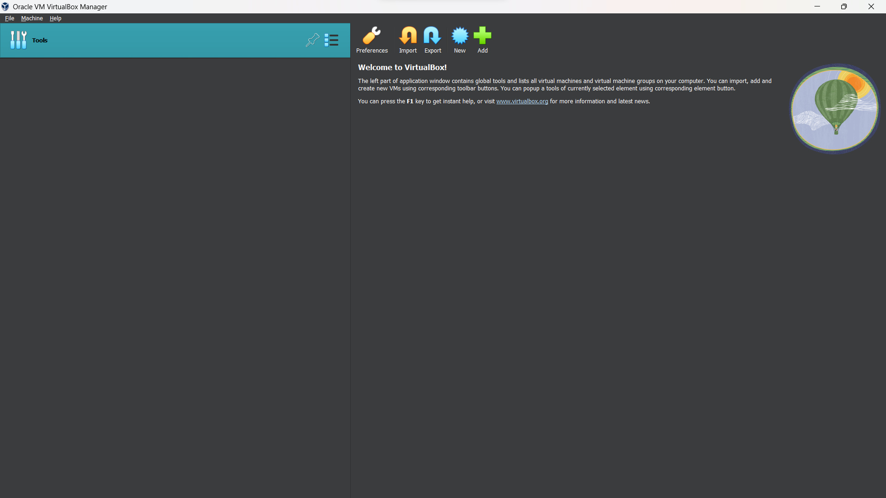

# EX. 2 - INSTALLATION OF OS - CASE STUDY

## Aim:
To install OS in VM Virtual Box on Windows

## Steps:
1. Download the Ubuntu ISO (Desktop version) on the official site and the VM Virtual Box.

2. Install VM Virtual Box and run it, we can see something like this.

3. Select "New" option to create a new Virtual OS. 

4. Fill in the name for Virtual OD & Choose the downloaded IOS Image. Click Next 

5. Fill in username & Password for the OS 

6. Allot the RAM & Number of Cores for the OS 

7. Allot Memory Space by choosing "Create a Virtual Hard Disk Now" and allot around 30 GB 

8. Check Everything & Click Finish. 

9. Allow VM Virtual Box to install OS 

10. After Installing Enter Your Password 

11. Now we can see the Home Screen of our Installed Ubuntu OS 

## Result
Thus, OS is installed in VM Virtual Box on Windows
